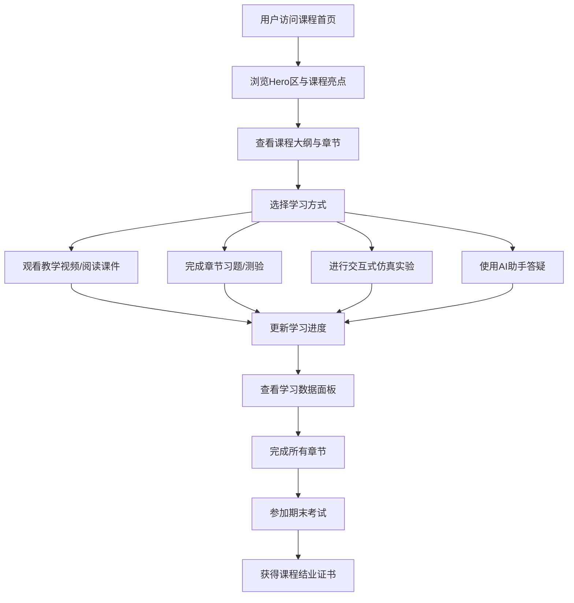

## 1. 产品概述

《自动控制原理》AI智慧课程主页是面向大学本科自动化、电气工程、机械工程等专业学生的一站式在线学习平台。通过融合AI智能辅助、交互式仿真实验、多媒体教学资源等功能，解决传统控制理论课程抽象难懂、实践环节不足的痛点，提升学习效率与学习体验。

- 目标用户：本科一至三年级工科学生、授课教师、自学者
- 核心价值：将抽象的控制理论可视化、可交互化，提供AI个性化辅导

## 2. 核心功能

### 2.1 用户角色

| 角色 | 登录方式 | 核心权限 |
|------|----------|----------|
| 学生用户 | 学号/邮箱登录 | 观看课程、做习题、使用AI答疑、参与实验、查看学习进度 |
| 教师用户 | 教师工号登录 | 发布作业、查看学生数据、管理课程内容 |
| 游客 | 免登录 | 浏览课程概览、体验部分Demo功能 |

### 2.2 功能模块

1. **课程首页**：Hero展示区、课程导航、课程亮点、AI助手入口、学习统计
2. **课程大纲模块**：章节树形结构、知识点标签、进度追踪、课时信息
3. **AI智慧学习区**：智能答疑、知识图谱、个性化推荐、错题分析
4. **交互式实验区**：仿真实验平台（阶跃响应、根轨迹、伯德图）、参数可调、实时可视化
5. **题库与作业模块**：章节练习、单元测验、期末考试、自动批改
6. **学习资源中心**：课件下载、教学视频、参考文献、扩展阅读
7. **学习进度面板**：学习时长、完成度、知识点掌握度、排行榜
8. **课程团队与通知**：师资介绍、课程公告、教学日历

### 2.3 页面详情

| 页面名称 | 模块名称 | 功能描述 |
|----------|----------|----------|
| 课程首页 | Hero横幅区 | 动态背景展示控制理论波形图，课程标题与Slogan，AI助手悬浮入口，快速开始按钮 |
| 课程首页 | 课程统计卡片 | 展示选课人数、完成课时、平均成绩、好评率四大核心指标，数字滚动动画 |
| 课程首页 | 课程亮点特色 | 6个特色卡片：AI智能辅导、仿真实验、知识图谱、多媒资源、个性化路径、权威教材 |
| 课程首页 | 课程大纲预览 | 8大章节手风琴展开，每章含知识点标签、课时数、完成进度条 |
| 课程首页 | AI学习助手 | 对话式UI演示，展示常见问题快捷入口，AI推荐学习路径 |
| 课程首页 | 交互式实验Demo | 3个核心仿真实验卡片，点击弹出预览窗口，含滑块参数调节 |
| 课程首页 | 学习资源推荐 | 精选课件、视频、文献卡片，带预览图与下载标识 |
| 课程首页 | 师资团队介绍 | 4位教师卡片，含头像、职称、研究方向、授课章节 |
| 课程首页 | 学习排行榜 | Top5学生展示，带动画头像、学习时长、积分，当前用户排名 |
| 课程首页 | 页脚区 | 课程信息、联系方式、友情链接、版权声明、返回顶部按钮 |

## 3. 核心流程

学生进入课程首页 → 浏览课程概览与亮点 → 查看课程大纲明确学习路径 → 进入对应章节观看视频/阅读课件 → 完成章节练习与测验 → 使用AI答疑解惑 → 进行交互式仿真实验巩固知识 → 查看学习进度面板调整学习计划 → 完成所有内容后参加期末考试

## 4. 用户界面设计

### 4.1 设计风格

- **主色调**：科技蓝（#1e40af 深蓝作为品牌色）+ 信号青（#06b6d4 辅助色，呼应控制信号主题）
- **配色方案**：
  - 背景：渐变深蓝 #0f172a → #1e293b，营造专业理工氛围
  - 中性色：slate系列灰阶，确保文字可读性
  - 强调色：琥珀橙 #f59e0b 用于数据高亮与CTA按钮
- **按钮风格**：圆角8px，渐变填充，hover上浮+阴影增强，active微缩反馈
- **字体方案**：
  - 标题："Noto Serif SC" 思源宋体，传递学术权威感
  - 正文："JetBrains Mono" 等宽字体用于公式代码 + "Noto Sans SC" 思源黑体用于常规文本
- **布局风格**：卡片式+玻璃拟态（Glassmorphism），层次分明，背景含控制理论公式水印与动态波形动画
- **图标风格**：Lucide图标库，线性风格，统一24px基础尺寸，配信号流动画

### 4.2 页面设计概览

| 页面/模块 | UI元素 | 设计细节 |
|-----------|--------|----------|
| Hero横幅区 | 动态正弦波背景、大标题、副标题、CTA按钮组、AI浮窗 | 标题48px/700字重，双按钮主次区分（开始学习→橙色填充 / 预约演示→边框描边），背景含缓慢浮动的传递函数公式 |
| 统计数据卡片 | 4列网格、图标+数字+标签 | 卡片玻璃拟态，数字从0滚动到目标值，图标配发光效果 |
| 课程亮点区 | 6个图标卡片、2行3列网格 | 每个卡片含彩色图标块+标题+3行描述，hover时图标旋转15°，卡片轻微上浮+发光边框 |
| 课程大纲 | 手风琴折叠面板、章节序号、进度条、标签 | 展开动画平滑过渡300ms，当前章节高亮蓝色边框，已完成章节带绿色对勾 |
| AI助手模块 | 左侧对话预览+右侧功能入口 | 聊天气泡不同颜色区分AI/用户，快捷问题按钮胶囊样式，发送按钮脉动动画 |
| 仿真实验区 | 3张大图卡片、参数滑块示意、实时曲线图 | 卡片截图展示仿真界面，配"开始实验"按钮，hover放大预览图 |
| 学习资源 | 横向滚动卡片、封面缩略图、资源类型标签 | 视频标播放图标、PDF标文档图标、课件标幻灯片图标，hover显示预览弹窗 |
| 师资卡片 | 圆形头像、姓名职称、研究方向标签 | 卡片hover时头像外圈发光旋转，教师信息淡入滑出 |
| 排行榜 | 金银铜奖牌图标、用户头像、进度条 | Top3用户特殊渐变背景，当前用户行高亮+闪烁边框提示 |

### 4.3 响应式设计

- 桌面端（>1280px）：多列布局、最大宽度1440px居中、侧边悬浮导航
- 平板端（768-1280px）：自适应两列布局、统计卡片2x2网格、模块垂直堆叠
- 移动端（<768px）：单列垂直布局、汉堡菜单导航、卡片全屏宽度、字号缩小10%、隐藏次要动效保证性能

### 4.4 交互微动画

1. 页面加载：Hero区元素错峰淡入（标题→按钮→统计卡片→其余模块依次延后80ms）
2. 滚动触发：IntersectionObserver监听，模块进入视口时从下往上滑入+透明度从0→1
3. 卡片交互：hover时translateY(-6px) + box-shadow增强，transition 300ms cubic-bezier(0.4,0,0.2,1)
4. 数据流：数字统计countUp动画、进度条渐变填充动画、波形图持续播放正弦/阶跃信号
5. AI助手：消息气泡打字机效果、发送按钮loading脉冲、推荐标签逐个显现
