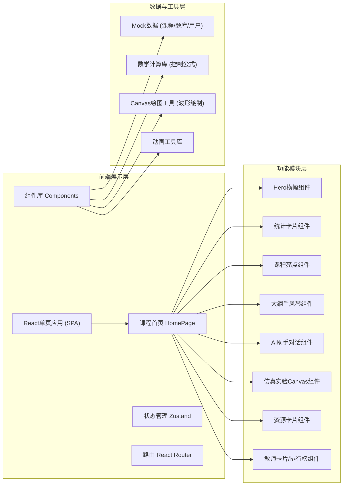

## 1. 架构设计



## 2. 技术栈说明

- **前端框架**：React 18 + TypeScript 5，严格类型检查
- **构建工具**：Vite 5，开发服务器HMR热更新
- **样式方案**：TailwindCSS 3 + CSS Variables，自定义主题配色
- **状态管理**：Zustand 4，轻量无侵入的学习状态存储
- **路由管理**：React Router v6，单页面路由（首页为根路由）
- **图标库**：Lucide React，统一线性风格图标
- **数学计算**：原生Math API实现传递函数、阶跃响应、伯德图计算
- **图表绘制**：原生Canvas 2D API绘制控制理论波形图、根轨迹图
- **动画方案**：CSS Keyframes + requestAnimationFrame + 滚动监听(IntersectionObserver)

## 3. 页面路由定义

| 路由路径 | 页面名称 | 说明 |
|---------|----------|------|
| `/` | 课程首页 (HomePage) | 包含所有核心模块的完整单页应用，锚点导航 |

## 4. 核心数据结构定义

```typescript
// 课程章节
interface Chapter {
  id: number;
  title: string;
  description: string;
  duration: string; // 总课时
  lessons: Lesson[];
  tags: string[];
  progress: number; // 0-100
  isCompleted: boolean;
}

// 课时小节
interface Lesson {
  id: string;
  title: string;
  type: 'video' | 'ppt' | 'experiment' | 'exercise';
  duration: number; // 分钟
  isCompleted: boolean;
}

// 教师信息
interface Teacher {
  id: number;
  name: string;
  title: string; // 职称
  avatar: string;
  research: string[]; // 研究方向
  chapters: number[]; // 负责章节ID
}

// 学生学习数据
interface StudentProgress {
  id: string;
  name: string;
  avatar: string;
  totalHours: number; // 学习时长(小时)
  score: number; // 积分
  rank: number;
  mastery: Record<string, number>; // 知识点掌握度
}

// AI对话消息
interface AIMessage {
  id: string;
  role: 'user' | 'ai';
  content: string;
  timestamp: number;
  suggestions?: string[]; // AI推荐的追问
}

// 仿真实验
interface Simulation {
  id: string;
  title: string;
  description: string;
  type: 'step' | 'bode' | 'rootlocus';
  parameters: SimParam[];
  preview: string;
}

interface SimParam {
  key: string;
  label: string;
  min: number;
  max: number;
  default: number;
  step: number;
}

// 学习资源
interface Resource {
  id: string;
  title: string;
  type: 'pdf' | 'video' | 'ppt' | 'reference';
  thumbnail: string;
  downloads: number;
  chapterId: number;
}

// 全局学习状态
interface LearningStore {
  currentStudent: StudentProgress;
  chapters: Chapter[];
  completedLessons: string[];
  aiMessages: AIMessage[];
  currentSimParams: Record<string, number>;
  incrementProgress: (lessonId: string) => void;
  addAIMessage: (msg: AIMessage) => void;
  setSimParam: (key: string, value: number) => void;
}
```

## 5. 项目目录结构

```
src/
├── App.tsx                     # 应用入口，路由配置
├── main.tsx                    # React挂载入口
├── index.css                   # 全局样式 + Tailwind + 自定义变量
├── pages/
│   └── HomePage.tsx            # 课程首页，组装所有模块
├── components/
│   ├── layout/
│   │   ├── Header.tsx          # 顶部导航栏
│   │   ├── Footer.tsx          # 页脚
│   │   └── ScrollSpyNav.tsx    # 侧边滚动锚点导航
│   ├── hero/
│   │   ├── HeroSection.tsx     # Hero横幅主区域
│   │   └── WaveBackground.tsx  # 动态波形背景Canvas
│   ├── stats/
│   │   └── StatsGrid.tsx       # 统计数据卡片网格
│   ├── highlights/
│   │   └── HighlightsGrid.tsx  # 课程亮点6宫格
│   ├── syllabus/
│   │   └── SyllabusAccordion.tsx # 课程大纲手风琴
│   ├── ai-tutor/
│   │   ├── AITutorPanel.tsx    # AI智慧学习主面板
│   │   └── ChatBubble.tsx      # 对话气泡组件
│   ├── simulation/
│   │   ├── SimCardGrid.tsx     # 仿真实验卡片
│   │   └── WaveCanvas.tsx      # 波形图Canvas组件
│   ├── resources/
│   │   └── ResourceSlider.tsx  # 学习资源横向滚动区
│   ├── team/
│   │   ├── TeacherCards.tsx    # 师资团队卡片
│   │   └── Leaderboard.tsx     # 学习排行榜
│   └── common/
│       ├── SectionTitle.tsx    # 通用节标题
│       ├── GradientCard.tsx    # 通用渐变卡片容器
│       ├── CountUpNumber.tsx   # 数字滚动动画
│       └── ScrollReveal.tsx    # 滚动触发动画容器
├── store/
│   └── useLearningStore.ts     # Zustand学习状态存储
├── data/
│   ├── mockChapters.ts         # 课程大纲Mock数据
│   ├── mockTeachers.ts         # 教师Mock数据
│   ├── mockStudents.ts         # 学生排行Mock数据
│   ├── mockResources.ts        # 学习资源Mock数据
│   └── mockSimulations.ts      # 仿真实验Mock数据
├── utils/
│   ├── controlMath.ts          # 控制理论数学计算(阶跃/伯德/根轨迹)
│   └── canvasDrawer.ts         # Canvas绘图辅助函数
└── types/
    └── index.ts                # TypeScript类型定义
```

## 6. 关键实现要点

### 6.1 动态波形背景 (WaveBackground)
- 使用双Canvas叠加：底层慢速正弦波 + 顶层快速脉冲信号
- 3条不同频率的正弦波（y1=A1·sin(ω1·t+x), y2=A2·sin(ω2·t+φ)...）
- requestAnimationFrame驱动，性能节流60FPS
- 颜色使用rgba通道透明度叠加，产生层次流动感

### 6.2 控制理论数学计算 (controlMath.ts)
- 一阶系统阶跃响应：h(t) = 1 - e^(-t/T)
- 二阶系统阶跃响应（欠阻尼）：包含自然频率ωn、阻尼比ζ参数
- 伯德图计算：幅值=20log10|G(jω)| dB，相位=∠G(jω) rad
- 根轨迹绘制：基于特征方程1 + K·G(s)H(s) = 0

### 6.3 数字滚动动画 (CountUpNumber)
- requestAnimationFrame递归 + easeOutExpo缓动函数
- duration=1500ms，根据位数自动计算步进增量
- 支持千分位分隔符、百分比符号后缀

### 6.4 滚动触发动画 (ScrollReveal)
- IntersectionObserver API，threshold=0.15触发
- 初始状态：translateY(40px) + opacity: 0
- 激活状态：transform还原 + opacity: 1，transition: 600ms cubic-bezier(0.22, 1, 0.36, 1)
- 子元素stagger动画延迟（每个递增60ms）

### 6.5 玻璃拟态样式 (Glassmorphism)
- backdrop-filter: blur(16px) saturate(180%)
- background: rgba(15, 23, 42, 0.55)
- border: 1px solid rgba(255,255,255,0.08)
- box-shadow: 0 8px 32px rgba(0,0,0,0.3)
